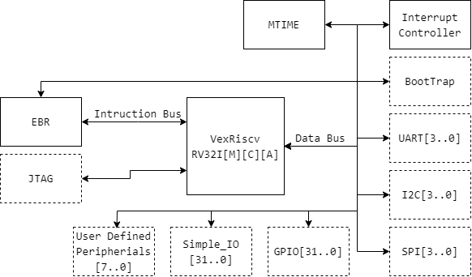

# RiscDuinoV

This repository contains an configurable SoC (System on Chip) implementation with generic components that we can find in a standard microcontroller and with support to add user defined components. This SoC is embed with a VexRiscv processor described in SpinalHDL which executes instructions subsets of RV32I[M][C][A].

## RiscDuinoV SoC

|  |
|:--:|
| *RiscDuinoV SoC diagram* |
All dotted components are optional when synthesizing. On the Top level file you can choose what you want to embed in the SoC.

### BootTrap

The boottrap is a component essentially used by the **bootloader** and the **Programmer**. It allows to reboot VexRiscv in boot mode or in user mode. Basically you can use it with only a terminal and bypass the **Programmer** tool. Here are the following commands :  

- +++0 &rarr; reboots VexRiscv and checks if a program is available in RAM
- +++1 &rarr; reboots VexRiscv and listen in the Serial Port for an incoming program. After receiving it stores the program in Flash
- +++2 &rarr; reboots VexRiscv and listen in the Serial Port for an incoming program. It stores only the program in RAM.

### UART

Simple UART component configured in 8N1. Baudrate is changeable. Future modes like parity bit are planned. Configurable FIFO size and interrupt support if a byte is received from the UART. At least 1 UART must be available if you use RiscDuinoV with a bootloader.

### I2C

Simple I2C Master component with configurable Sck speed. No FIFO or interruptions supported.

### SPI

Simple SPI component configurable Sck speed but with a frozen mode 0. Component borrowed from [F32C SoC](https://github.com/f32c/f32c). No FIFO or interrupt support.

### GPIO

Simple GPIO that can be configured in I/O. PWM mode planed in the future.

### Simple_IO

Those are simple I/O that occupies only 1 address. They are intended to read simple inputs ou write simple outputs.

### Interrupt_Controller

Interrupt controller that sends an IRQ (Interrupt ReQuest) to VexRiscv if the bit N of the vector and the mask are both true. No priority is supported. First come, first served.

    INTERRUPT_MASK and INTERRUPT_VECTOR >= 1

From 0 to 31 are the SoC interrupts used by UART, timers, GPIO. From 32 to 63 are the user defined interrupts that are available for you if your component needs to send an IRQ to VexRiscv.

| Component | Interrupts numbers    |       Note            |
| --------- | :-------------------: | -----------           |
| UART      |       0 to 3          |                       |
| GPIO      |       8 to 15         | Not fully supported   |
| Timers    |           16 to 31    | 2 interrupts per timer  Even &rarr; timer value overflow compares value odd &rarr; Timer value reached 0 |
| User defined perepherials | 32 to 63 |                        |

### MTIME

MTIME is a 64 bit hardware timer that matches the RISC-V ISA standard with a 64-bit register with a timer value register and another 64-bit compare register. If the value of the timer register overflows the compare value register then an IRQ is sended to VexRiscv.

### Timers

Simple 32-bit hardware timers that are easily configurable. They work as MTIME timer. Interrupts are available if the timer value reaches 0 or if the timer value overflows the value of the compare register.

### User Defined Peripherials

User defined components can be connected to the SoC independently of the system components. An interface with VexRiscv bus will be necessary but it's not that complex. Examples are provided to inspire you how connect the bus with your components. Standard bus interface is planned in the future.

### JTAG

JTAG is used to debug your program using GDB with OpenOCD. If you use the JTAG you don't need to have the bootloader.

## How to use

Three ready to use projects for the three big families of FPGA (Altera, Lattice, Xilinx) are available in **Hardware/rtl/proj** for DE0-Nano, MachXO3LF or Arty S7-50 boards. You just need to open the project, compile and send the bitstream to your FPGA. Once sended on a Serial Port, you should see the following message **RISCV** which indicates that RiscDuinoV is waiting for a program to be sended through the Serial Port. If you want to port the project to another FPGA, you just need to change the chip, reconfigure the pins and it should be good.

By default the project is configured with VexRiscv without JTAG and a bootloader.

Check [here](https://github.com/RiscDuinoV/Software) to learn how to send a program.

## Cloning the repository

    git clone https://github.com/RiscDuinoV/RISCV

Once cloned, go to cloned repository and then fetch all submodules :

    git submodule update --init --recursive

## Updating

To update the repository :

    git pull origin/master

To update the submodules :

    git submodule update --recursive --remote
